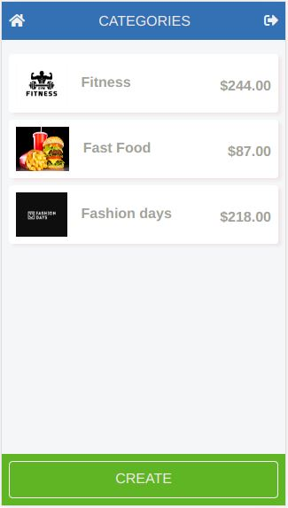

# Moneytrack:

A mobile money tracker application.



## Description:

A mobile web application where a user manage its budget: have a list of transactions associated with a category, so that the user can see how much money it spent and on what.

## Live Link:

[Heroku](https://murmuring-river-52663.herokuapp.com/)

## Video Demo:

[Demo](https://www.loom.com/share/9db510ba3fcf4347a06bb2db4820960a)

## Entity Relationship Diagram


## Built With

- Ruby
- Ruby on Rails
- PostgreSQL
- SASS
- CSS

## Getting Started

To get a local copy up and running follow these simple example steps.

## Instructions

```
$ cd <folder>
```

```
$ git clone git@github.com:PolinaStamenova/moneytrack.git
```

```
$ cd moneytrack
```

## Install

```
$ bundle install
```

## Run

```
$ rails db:create
```

```
$ rails db:migrate
```

## Authors

👤 **Polina Stamenova**

- GitHub: [@githubhandle](https://github.com/PolinaStamenova)
- LinkedIn: [LinkedIn](https://www.linkedin.com/in/polina-stamenova-a60766112/)

## 🤝 Contributing

Contributions, issues, and feature requests are welcome!

Feel free to check the [issues page](https://github.com/PolinaStamenova/moneytrack/issues).

## Show your support

Give a ⭐️ if you like this project!

## Acknowledgments

- Microverse
- Creative Commons license of the design
